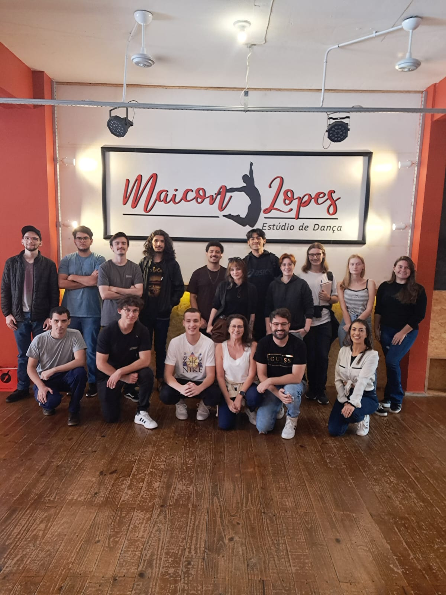

# README - Studio de Dança

Este é um projeto Maven Java desenvolvido para um Studio de Dança fictício. O objetivo deste projeto é fornecer uma aplicação básica que possa ser utilizada para gerenciar alunos, instrutores e aulas em um estúdio de dança.

### Requisitos do Sistema:
- JDK (Java Development Kit) instalado em sua máquina
- Maven instalado em sua máquina
- IDE Java (como IntelliJ IDEA, Eclipse, NetBeans, etc.) para desenvolvimento

Clonar Repositório
```bash
git clone https://github.com/karmineg/LPOO_StudioDanca.git
```

### Agradecimentos:
#### Agradecemos por considerar o uso deste projeto para gerenciar seu **Studio de Dança Maicon Lopes 🤖💃**. Se encontrar algum problema ou tiver sugestões para melhorias, não hesite em nos informar.

